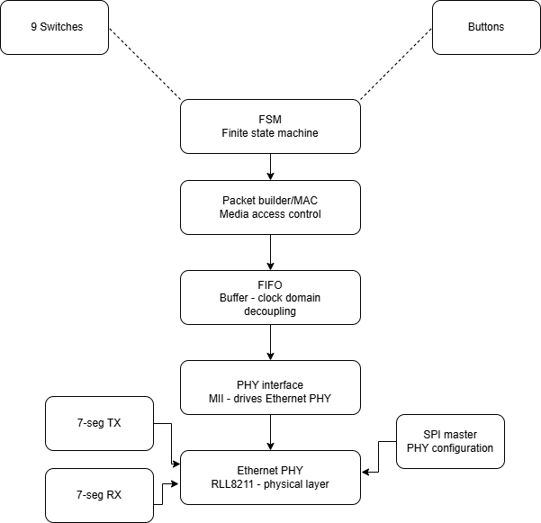
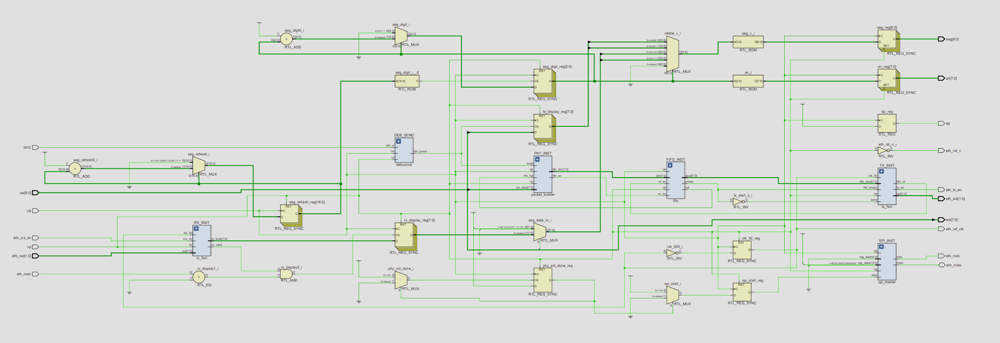
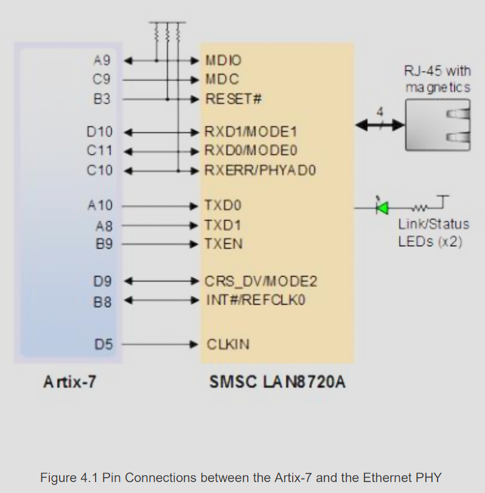
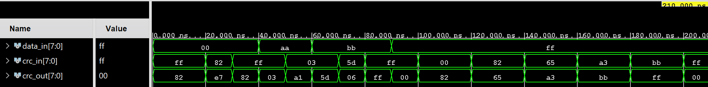
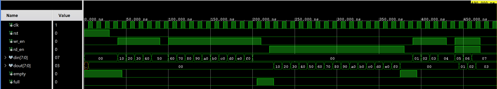
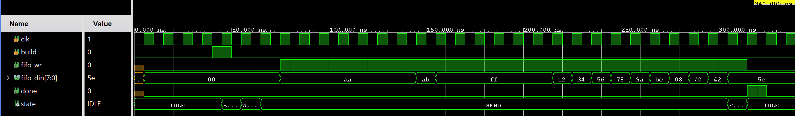
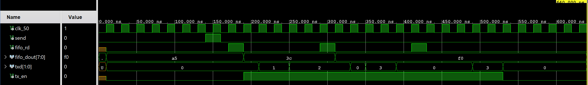
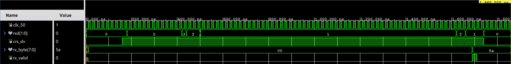

# VHDL Ethernet Packet Sender — Nexys A7-50T

> **Mirror.** This repository is a copy of the original project hosted on GitLab:
> [gitlab.com/fekt_projects/vhdl/ethernet](https://gitlab.com/fekt_projects/vhdl/ethernet)

A hardware project implemented in VHDL on the **Digilent Nexys A7-50T**
FPGA board, enabling real-time bidirectional Ethernet communication
between two boards using standard Ethernet frames.

## Overview

The project allows two Nexys A7-50T boards to exchange byte-sized
messages over Ethernet. The user composes the byte to send using the
onboard switches `sw[7:0]`, presses `btnC` to send, and the byte is
framed into a 24-byte Ethernet packet and transmitted via the onboard
PHY chip. The peer board decodes the frame and shows the received byte
on its 7-segment display.

## Features

- Real-time Ethernet frame transmission and reception (RMII, 100 Mb/s)
- Message byte selected via 8 toggle switches (bottom-right of the board)
- `btnC` (centre) sends the framed packet
- Shared 8-digit 7-segment display: TX byte on `AN0/AN1`, RX byte on `AN6/AN7`
- Own MAC-address high byte shown on the RX side via `sw[8]` toggle (bottom-left)
- Full packet construction: preamble → SFD → DST → SRC → EtherType → payload → CRC-8

  

**Figure 1.** Block diagram of the Ethernet Packet Sender architecture.

## Hardware

| Component   | Details                              |
|-------------|--------------------------------------|
| **Board**   | Digilent Nexys A7-50T                |
| **FPGA**    | Xilinx Artix-7 (XC7A50T)            |
| **PHY**     | SMSC LAN8720A (onboard, RMII, `0x01`) |
| **IDE**     | AMD Vivado Design Suite 2025.2       |

  

**Figure 2.** Top-level schematic.

## Module Hierarchy

The design uses a flat instantiation tree under `top.vhd` with one MAC
builder, two RMII FSMs, a FIFO between builder and TX, and a one-shot
SPI/MDIO master for PHY configuration. The whole MAC fabric runs on a
single `clk_50` domain; the 100 MHz pin clocks only the toggle FF that
generates `clk_50`, which is then promoted to a global clock network by
an explicit `BUFG`. Because everything else is on `clk_50`, there is no
clock-domain crossing inside the design.

| Module           | File                                                        | Role |
|------------------|-------------------------------------------------------------|------|
| `top`            | `Ethernet.srcs/sources_1/top.vhd`                           | Top-level — wires everything together, drives the 7-seg, generates `clk_50` (toggle FF + `BUFG`) and forwards `eth_ref_clk` to the PHY through an `ODDR` |
| `packet_builder` | `Ethernet.srcs/sources_1/packet_builder.vhd`                | Builds the 24-byte frame, accumulates CRC-8, pushes bytes into the FIFO |
| `fifo`           | `Ethernet.srcs/sources_1/fifo.vhd`                          | First-word-fall-through FIFO 16 × 8 between builder and TX (`dout` is combinational on `mem(rd_ptr)`) |
| `tx_fsm`         | `Ethernet.srcs/sources_1/tx_fsm.vhd`                        | Reads the FIFO, drives RMII TX dibits LSB-first at 50 MHz |
| `rx_fsm`         | `Ethernet.srcs/sources_1/rx_fsm.vhd`                        | Receives RMII, detects SFD, extracts payload byte |
| `crc8`           | `Ethernet.srcs/sources_1/crc8.vhd`                          | Combinational CRC-8 (polynomial `0x07`) |
| `spi_master`     | `Ethernet.srcs/sources_1/spi_master.vhd`                    | One MDIO write to PHY register 0 (auto-neg + full duplex) |
| `debounce`       | `Ethernet.srcs/sources_1/lab_modules/debounce.vhd`          | Standard lab debouncer for `btnC`, runs on `clk_50` (`C_MAX = 100_000` → 2 ms sampling period) |
| `clk_en`         | `Ethernet.srcs/sources_1/lab_modules/clk_en.vhd`            | Standard lab clock-enable generator (used by `debounce`) |

## Frame Structure (24 bytes)

| Bytes  | Field      | Value |
|--------|------------|-------|
| 0..6   | Preamble   | 7 × `0xAA` |
| 7      | SFD        | `0xAB` |
| 8..13  | DST MAC    | broadcast `FF:FF:FF:FF:FF:FF` |
| 14..19 | SRC MAC    | configurable via generic `SRC_MAC` (default `AA:BB:CC:DD:EE:FF`) |
| 20..21 | EtherType  | `0x0800` (IPv4) |
| 22     | Payload    | `sw[7:0]` |
| 23     | CRC-8      | `poly = 0x07`, `init = 0xFF`, over bytes `[8..22]` |

> The preamble/SFD pattern (`0xAA…0xAB`) is **non-standard** —
> IEEE 802.3 specifies `0x55…0xD5`.

## Pin Assignments

System and user I/O:

| Signal       | FPGA pin | IO standard | Notes |
|--------------|----------|-------------|-------|
| `clk`        | E3       | LVCMOS33    | 100 MHz onboard |
| `rst` (`btnR`) | M17    | LVCMOS33    | active-high |
| `btnC`       | N17      | LVCMOS33    | send button |
| `sw[0..7]`   | J15, L16, M13, R15, R17, T18, U18, R13 | LVCMOS33 | payload byte |
| `sw[8]`      | T8       | **LVCMOS18** | RX/MAC display toggle, 1.8 V bank |
| `led[0..7]`  | mirror `sw[7:0]` | LVCMOS33 | activity feedback |

Ethernet PHY (LAN8720A):

| FPGA pin | PHY signal          |
|----------|---------------------|
| A10      | TXD0                |
| A8       | TXD1                |
| B9       | TXEN                |
| C11      | RXD0 / MODE0        |
| D10      | RXD1 / MODE1        |
| C10      | RXERR / PHYAD0      |
| D9       | CRS_DV / MODE2      |
| D5       | CLKIN (50 MHz from FPGA) |
| B3       | RESET# (active low) |
| A9       | MDIO                |
| C9       | MDC                 |

Constraints live in `Ethernet.srcs/constrs_1/nexys.xdc`.

  

**Figure 3.** PHY Pinout on Nexys A7 board.
Source: Nexys A7-50T Reference Manual.

## Build & Run

### Open the project in Vivado

1. *File → Open Project* → `Ethernet.xpr`
2. Part is **xc7a50tcsg324-1**, top entity is `top`.
3. *Run Synthesis → Run Implementation → Generate Bitstream → Program Device*.

## Simulations

All five testbenches **pass** (no `severity error` / `failure`) under
Vivado XSim 2025.2.

### `tb_crc8` — combinational CRC

Drives a few byte sequences through the CRC and accumulates the running
checksum.

  

What to look for: `data_in` changes → `crc_out` updates the same delta
cycle (combinational). For `data_in = 0x00` with `crc_in = 0xFF`,
`crc_out = 0x82`.

### `tb_fifo` — synchronous FIFO 16 × 8

Four sub-tests: write 5 bytes, fill to full (16), drain everything,
simultaneous read+write.

  

What to look for: `empty` falls after the first write, `full` rises at
byte 16, `empty` returns after the drain, level stays constant during
simultaneous r+w.

### `tb_packet_builder` — frame assembly

Pulses `build`, captures all 24 bytes the builder writes into the FIFO,
asserts each field against the spec.

  

What to look for: 24 consecutive `fifo_wr` pulses; on `fifo_din` the
sequence
`AA AA AA AA AA AA AA AB  FF FF FF FF FF FF  12 34 56 78 9A BC  08 00 42 5E`
when `sw_data = 0x42` and `SRC_MAC = 0x123456789ABC`.

### `tb_tx_fsm` — RMII transmit FSM

Sends 3 bytes (`A5 3C F0`) through a model FIFO and checks the dibit
stream.

  

What to look for: `tx_en` stays high for 12 consecutive 50 MHz cycles
(3 bytes × 4 dibits); `txd` outputs LSB-first dibits.
For `0xA5 = 1010_0101`: dibits are `01, 01, 10, 10`.

> The testbench overrides `FRAME_LEN => 3` because the model FIFO only
> holds 3 bytes. The synthesised `top` uses the default `FRAME_LEN = 24`.

### `tb_rx_fsm` — RMII receive FSM

Drives a synthetic frame (`AA AA AA AB` + 14 header bytes + payload
`0x5A`) and verifies SFD detection plus payload extraction.

  

What to look for: after `crs_dv` rises, the FSM walks
`PREAMBLE → SKIP → PAYLOAD → DONE_ST`, ending with a one-cycle
`rx_valid` pulse and `rx_byte = 0x5A`.

## Resource Report

| Resource | Used | Available | Util % |
|----------|-----:|----------:|-------:|
| LUT      |  163 |    32 600 |   0.54 |
| FF       |  197 |    65 200 |   0.30 |
| IO       |   47 |       210 |  22.38 |
| BUFG     |    2 |        32 |   6.25 |

Two `BUFG`s are used: one for the 100 MHz pin (auto-inserted by Vivado
for `clk`) and one explicitly instantiated for `clk_50`.

## Known Limitations

1. **Custom preamble / SFD** (`0xAA / 0xAB`) — not IEEE 802.3
   (`0x55 / 0xD5`). Two of our boards talk fine; off-the-shelf hosts and
   Wireshark mark frames as malformed.
2. **CRC-8** instead of CRC-32 — chosen for simplicity.
3. **`clk_50` from a logic toggle FF + `BUFG`** — works and is on a
   global clock network, but a `MMCM`/`PLL` would give lower jitter and
   a configurable phase shift to the PHY.
4. **`eth_rxerr`** is sampled at the top level (drops the RX-display
   latch on rxerr) but `rx_fsm` itself does not abort the frame on a
   mid-frame rxerr.
5. **MDIO `inout`** — physically unavoidable for a tri-state line.
6. **PHY reset timing** — `eth_rst_n <= not rst`. The LAN8720A
   datasheet asks for ≥ 25 ms after RST# release before MDIO accesses;
   current design fires the single MDIO write immediately.

## Tools Used

| Tool | Purpose |
|------|---------|
| AMD Vivado Design Suite 2025.2 | Synthesis, implementation, simulation (XSim), bitstream |
| Visual Studio Code | Editor with VHDL syntax extension |
| Git | Version control |

## Authors

| Name | Role |
|------|------|
| Ondřej Polášek | Project Lead |
| Ladislav Šilhán | Designer |
| Maxim Sudakov | Developer |
| Alexandr Stoljar | Developer |

## References

1. [Tomas Fryza GitHub](https://github.com/tomas-fryza/vhdl-examples/)
2. [Nexys A7™ Reference Manual](https://digilent.com/reference/_media/reference/programmable-logic/nexys-a7/nexys-a7_rm.pdf)
3. [Ethernet Frame — Wikipedia](https://en.wikipedia.org/wiki/Ethernet_frame)
4. [Media-Independent Interface — Wikipedia](https://en.wikipedia.org/wiki/Media-independent_interface)
5. [LAN8720A Datasheet (Microchip)](https://ww1.microchip.com/downloads/en/DeviceDoc/8720a.pdf)
6. [RMII Specification, rev 1.2](https://web.archive.org/web/20160805174014/http://ebook.pldworld.com/_eBook/-Telecommunications,Networks-/TELECOM/RMII/rmii_rev12.pdf)
7. [IEEE 802.3-2018 — Ethernet](https://standards.ieee.org/ieee/802.3/7071/)
8. [VHDL Coding Style — VUT FEKT lab notes](https://github.com/tomas-fryza/vhdl-examples/wiki)